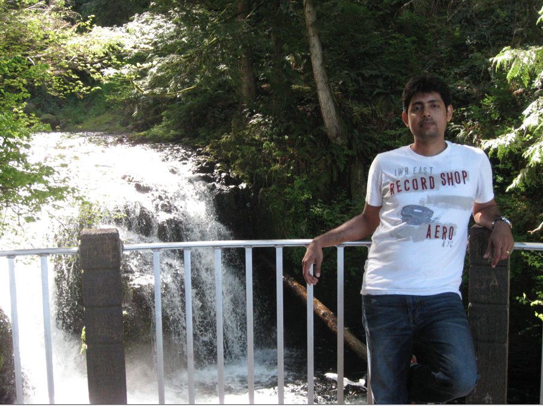

# Personal Information

## Name
Sravan Kumar Thokala

## Email
sravan.thokala@colorado.edu

## Photo

## Website

# Current Funding
None.

# PhD Program

## Thesis Advisor
Prof. Shivakant Mishra

## Committee

* Prof. Shivakant Mishra

## Milestones

| Milestone            | Completed         | Planned           |         
| -------------------- | ----------------- | ----------------- |
| Start                | Fall 2013         |                   |
| Area Exam            |                   | Spring 2015       |
| Proposal Defense     |                   | Fall 2015         |
| Dissertation Defense |                   | Fall 2016         |

## Courses

| Course                                              | Taken             | Planned            | Depth    | Breadth | 
| --------------------------------------------------- | ----------------- | ------------------ | -------- | ------- |
| CSCI 5448 Object Oriented Analysis and Design       | Spring 2011       | Spring 2011        | no       | yes     |
| CSCI 5673 Distributed Systems                       | Spring 2010       | Spring 2010        | no       | yes     |
| CSCI 5273 Network Systems                           | Spring 2011       | Spring 2011        | no       | yes     |
| CSCI 5573 Adv Operating Systems                     | Fall 2010         | Fall 2010          | no       | yes     |
| CSCI 5623 Real Time Embedded Systems                | Fall 2010         | Fall 2010          | yes      | no      |
| CSCI 5543 SW Engg of Standalone Sys                 | Spring 2011       | Spring 2011        | yes      | no      |
| CSCI 5523 Compiler Construction                     | Fall 2009         | Fall 2009          | yes      | no      |
| CSCI 7123 Topics in Operating Systems               | Spring 2011       | Spring 2011        | yes      | no      |
| ECEN 5114 Automatic Control Systems                 | Fall 2009         | Fall 200           | yes      | no      |
| CSCI 7900 Doctor's Level Ind Stdy                   | Fall 2014         | Fall 2014          | yes      | no      |

# Research

## Publications

* Virtual GPS: A Middleware for Power Efficient Localization of Smartphones Using Cross Layer Approach, Middleware 2014, ACM/IFIP/USENIX, December 8 – 12, 2014, Bordeaux, France.
* Towards green mobile systems: Cross-layer-Predict-Store ’and’/’or’ Transmit. QTech 2014, Qualcomm, San Diego, CA, USA.
* WildSense:  Field Tests of a Mobile Sensor Network for Observing Contacts Between Individuals, April 2014, WILDLIFE SOCIETY BULLETIN
* Location based routing using smartphones in an infrastructureless environment. SAC 2012: 594-599.
* GPS assisted adhoc routing using cellphones for poorly connected areas. NSDR '10 Proceedings of the 4th ACM Workshop on Networked Systems for Developing Regions Article No. 16  ACM New York, NY, USA ©2010  table of contents ISBN: 978-1-4503-0193-0 doi>10.1145/1836001.1836017
* "Developing a data-transfer model for a novel wildlife-tracking network", Wildlife Society Bulletin,  Volume 36, Issue 4, pp. 820–827, December 2012,  DOI: 10.1002/wsb.188.

## Presentations

* Virtual GPS,Bordeaux, France,Dec 8, 2014
* Towards Green Mobile Systems,San Diego, CA, 7 Aug,2014, [pdf](files/NS-889-TowardsgreenmobilesystemsCrosslayerPredi_20140611120859-v2.pdf)
      
## Awards

* Inst Tuition Assist-Merit-Est
* Priv Tuition Assist-Fall

# Teaching

# Service

# Highlights

## Virtual GPS: A Middleware for Power Efficient Localization of Smartphones Using Cross Layer Approach, Middleware 2014, ACM/IFIP/USENIX, December 8 – 12, 2014, Bordeaux, France.

## Towards green mobile systems: Cross-layer-Predict-Store ’and’/’or’ Transmit. QTech 2014, Qualcomm, San Diego, CA, USA.

## WildSense: Monitoring Interactions among Wild Deer in Harsh Outdoor Environments using a Delay Tolerant WSN Sensors 2013, xx, 1-x; doi:10.ISSN 1424-8220

## Novel Cross Layer Energy optimization experiments using predictive location information. Gossip information map exchange b/w nodes for next best available power locations.

## Virtual GPS and Sensor Hub: An integrated solution for seamless location information based on desired location accuracy from application layer.

## Collaboration with University Of Texas, Houston to work with on Cross Layer optimization techniques for energy saving experiments using battery technology.

